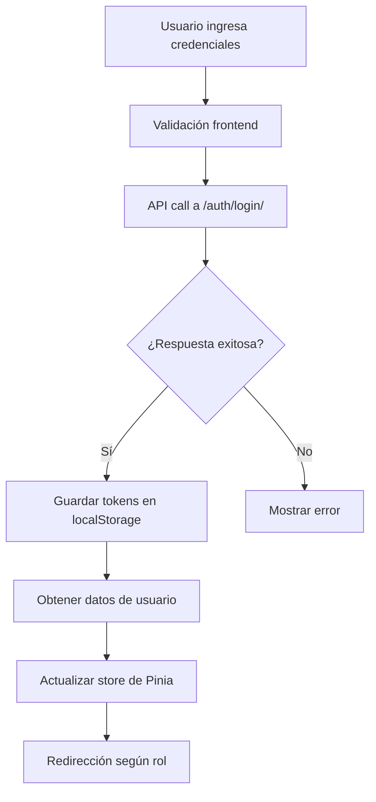
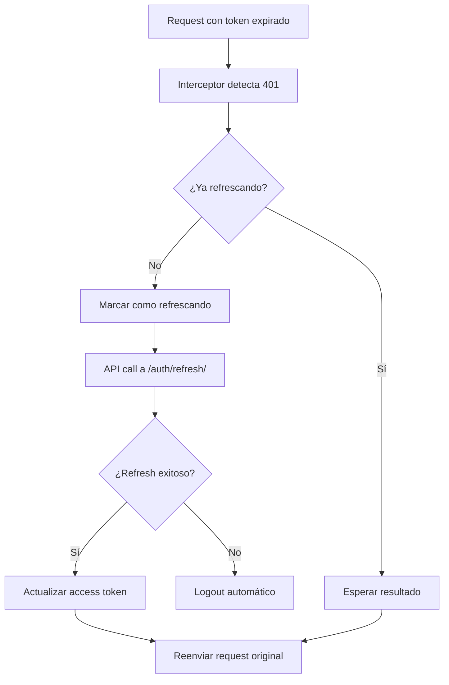
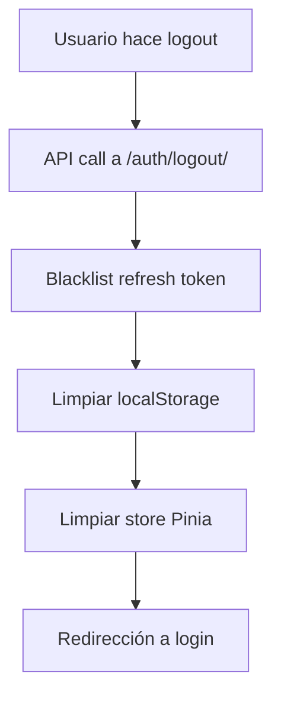

# Guía de Autenticación Frontend - CacaoScan

Esta guía documenta el sistema completo de autenticación implementado en el frontend de CacaoScan usando Vue.js 3, Pinia y JWT.

## 🏗️ Arquitectura del Sistema

### Componentes Principales

1. **Auth Store (Pinia)** - Gestión global del estado de autenticación
2. **Auth Service** - API calls para autenticación
3. **HTTP Interceptors** - Manejo automático de tokens JWT
4. **Route Guards** - Protección de rutas por rol y permisos
5. **Auth Components** - Componentes de UI para login/registro
6. **Navigation Integration** - Navbar que refleja estado de auth

## 🏪 Auth Store (Pinia)

### Estado Principal

```javascript
// Estado reactivo
const user = ref(null)                    // Datos del usuario
const accessToken = ref(null)             // Token JWT de acceso
const refreshToken = ref(null)            // Token JWT de refresh
const isLoading = ref(false)              // Estado de carga
const error = ref(null)                   // Errores de autenticación
const lastActivity = ref(Date.now())      // Última actividad
```

### Getters Computados

```javascript
// Estados derivados
const isAuthenticated = computed()        // ¿Usuario autenticado?
const userRole = computed()               // Rol del usuario
const isAdmin = computed()                // ¿Es administrador?
const isFarmer = computed()               // ¿Es agricultor?
const isAnalyst = computed()              // ¿Es analista?
const isVerified = computed()             // ¿Email verificado?
const userFullName = computed()           // Nombre completo
const userInitials = computed()           // Iniciales para avatar

// Permisos específicos
const canUploadImages = computed()        // Puede subir imágenes
const canViewAllPredictions = computed()  // Puede ver todas las predicciones
const canManageUsers = computed()         // Puede gestionar usuarios
```

### Actions Principales

```javascript
// Autenticación
await authStore.login(credentials)       // Iniciar sesión
await authStore.register(userData)       // Registrar usuario
await authStore.logout()                 // Cerrar sesión

// Gestión de usuario
await authStore.getCurrentUser()         // Obtener datos actuales
await authStore.updateProfile(data)      // Actualizar perfil
await authStore.changePassword(data)     // Cambiar contraseña

// Verificación y recuperación
await authStore.verifyEmail(uid, token)  // Verificar email
await authStore.requestPasswordReset(email)  // Solicitar reset
await authStore.resendEmailVerification()    // Reenviar verificación

// Utilidades
authStore.hasPermission(permission)      // Verificar permiso específico
authStore.checkSessionTimeout()          // Verificar timeout de sesión
authStore.updateLastActivity()           // Actualizar actividad
```

## 🌐 Servicio de API

### Configuración Axios

```javascript
// Configuración base
const api = axios.create({
  baseURL: 'http://localhost:8000/api',
  timeout: 30000,
  headers: {
    'Content-Type': 'application/json',
    'Accept': 'application/json'
  }
})
```

### Interceptores

#### Request Interceptor
- Agrega automáticamente el token Bearer a todas las requests
- Logs de debugging en desarrollo
- Timestamp para medir performance

#### Response Interceptor
- Manejo automático de refresh de tokens (401)
- Gestión de errores por tipo (403, 429, 500)
- Logs de respuesta y errores
- Redirección automática en caso de token expirado

### Funciones del Servicio

```javascript
// Autenticación básica
authApi.login(credentials)
authApi.register(userData)
authApi.logout(refreshToken)
authApi.refreshToken(refreshToken)

// Gestión de usuario
authApi.getCurrentUser()
authApi.updateProfile(profileData)
authApi.changePassword(passwordData)

// Recuperación de cuenta
authApi.requestPasswordReset(email)
authApi.confirmPasswordReset(resetData)
authApi.verifyEmail(uid, token)
authApi.resendEmailVerification()

// Administración (admin only)
authApi.getUserStats()
authApi.bulkUserActions(actionData)
authApi.getUsers(params)
```

## 🛡️ Guards de Rutas

### Guards Básicos

```javascript
// Autenticación requerida
beforeEnter: requireAuth

// Solo usuarios no autenticados
beforeEnter: requireGuest

// Rol específico
beforeEnter: requireRole(['admin', 'analyst'])

// Usuario verificado
beforeEnter: requireVerified

// Permiso específico
beforeEnter: requirePermission('upload_images')
```

### Guards Combinados

```javascript
// Configuraciones predefinidas
ROUTE_GUARDS = {
  public: [],                           // Acceso público
  guest: [requireGuest],               // Solo no autenticados
  auth: [requireAuth, updateActivity], // Autenticado básico
  verified: [requireAuth, requireVerified, updateActivity],
  
  // Por rol
  farmer: [requireAuth, requireRole(['farmer', 'admin']), updateActivity],
  farmerVerified: [requireAuth, requireRole(['farmer', 'admin']), requireVerified, updateActivity],
  analyst: [requireAuth, requireRole(['analyst', 'admin']), updateActivity],
  admin: [requireAuth, requireRole(['admin']), updateActivity],
  
  // Por permiso
  canUpload: [requireAuth, requireCanUpload, updateActivity],
  canViewAll: [requireAuth, requirePermission('view_all_predictions'), updateActivity],
  canManageUsers: [requireAuth, requirePermission('manage_users'), updateActivity]
}
```

### Uso en Rutas

```javascript
{
  path: '/prediccion',
  name: 'Prediction',
  component: PredictionView,
  beforeEnter: ROUTE_GUARDS.canUpload,  // Solo usuarios que pueden subir
  meta: {
    title: 'Análisis de Granos de Cacao | CacaoScan',
    requiresVerification: true
  }
}
```

## 🧭 Configuración de Rutas

### Estructura Organizada

```javascript
// Rutas públicas
{ path: '/', name: 'Home', component: HomeView }

// Autenticación (solo no autenticados)
{ path: '/login', beforeEnter: ROUTE_GUARDS.guest }
{ path: '/registro', beforeEnter: ROUTE_GUARDS.guest }

// Dashboards por rol
{ path: '/admin/dashboard', beforeEnter: ROUTE_GUARDS.admin }
{ path: '/analisis', beforeEnter: ROUTE_GUARDS.analyst }
{ path: '/agricultor-dashboard', beforeEnter: ROUTE_GUARDS.farmer }

// Funcionalidades específicas
{ path: '/prediccion', beforeEnter: ROUTE_GUARDS.canUpload }
{ path: '/reportes', beforeEnter: ROUTE_GUARDS.analyst }

// Gestión de cuenta
{ path: '/perfil', beforeEnter: ROUTE_GUARDS.auth }
{ path: '/verificar-email', beforeEnter: ROUTE_GUARDS.auth }

// Páginas de error
{ path: '/acceso-denegado', name: 'AccessDenied' }
{ path: '/:pathMatch(.*)*', name: 'NotFound' }
```

## 🧩 Componentes de Autenticación

### LoginForm.vue

```vue
<template>
  <div class="max-w-md mx-auto bg-white rounded-lg shadow-md p-6">
    <!-- Formulario de login con validación completa -->
    <form @submit.prevent="handleSubmit">
      <!-- Email/Username -->
      <input v-model="form.email" type="text" required />
      
      <!-- Password con show/hide -->
      <input v-model="form.password" :type="showPassword ? 'text' : 'password'" />
      
      <!-- Remember me -->
      <input v-model="form.remember" type="checkbox" />
      
      <!-- Submit button con loading -->
      <button :disabled="isLoading" type="submit">
        {{ isLoading ? 'Iniciando sesión...' : 'Iniciar Sesión' }}
      </button>
    </form>
    
    <!-- Links a registro y recuperación -->
  </div>
</template>
```

### NavbarComponent.vue

Navegación que se adapta automáticamente al estado de autenticación:

```vue
<template>
  <nav class="bg-white shadow-lg">
    <!-- Logo -->
    <router-link to="/">
      
    </router-link>

    <!-- Navegación según rol -->
    <template v-if="authStore.isAuthenticated">
      <!-- Dashboard específico por rol -->
      <router-link v-if="authStore.isFarmer" to="/agricultor-dashboard">
        Mi Dashboard
      </router-link>
      
      <!-- Funcionalidades según permisos -->
      <router-link v-if="authStore.canUploadImages" to="/prediccion">
        Analizar Cacao
      </router-link>
      
      <!-- Menu de usuario con dropdown -->
      <div class="relative">
        <button @click="showUserMenu = !showUserMenu">
          {{ authStore.userInitials }}
        </button>
        
        <!-- Dropdown con info y opciones -->
        <div v-show="showUserMenu">
          <p>{{ authStore.userFullName }}</p>
          <p>{{ authStore.userRole }}</p>
          <router-link to="/perfil">Mi Perfil</router-link>
          <button @click="handleLogout">Cerrar Sesión</button>
        </div>
      </div>
    </template>
    
    <!-- Botones para no autenticados -->
    <template v-else>
      <router-link to="/login">Iniciar Sesión</router-link>
      <router-link to="/registro">Registrarse</router-link>
    </template>
  </nav>
</template>
```

## 🔄 Flujos de Autenticación

### 1. Flujo de Login



### 2. Flujo de Refresh Token



### 3. Flujo de Logout



## 🎯 Casos de Uso por Rol

### Agricultor (Farmer)

```javascript
// Puede acceder a:
- Dashboard personal (/agricultor-dashboard)
- Subir imágenes (/prediccion) - solo si está verificado
- Ver sus propias predicciones
- Gestionar su perfil (/perfil)

// No puede acceder a:
- Panel de administración
- Ver datos de otros usuarios
- Gestionar dataset
- Entrenar modelos
```

### Analista (Analyst)

```javascript
// Puede acceder a:
- Dashboard de análisis (/analisis)
- Ver todas las predicciones del sistema
- Generar reportes (/reportes)
- Gestionar dataset
- Ver estadísticas del sistema

// No puede acceder a:
- Gestionar usuarios
- Entrenar modelos
- Configuraciones del sistema
```

### Administrador (Admin)

```javascript
// Puede acceder a:
- Panel completo de administración (/admin/dashboard)
- Gestión de usuarios (/admin/agricultores)
- Todas las funcionalidades de analista
- Entrenar modelos (/admin/training)
- Configuraciones del sistema (/admin/configuracion)
- Acciones masivas sobre usuarios

// Acceso completo al sistema
```

## 🛠️ Configuración de Desarrollo

### Inicialización en main.js

```javascript
import { createApp } from 'vue'
import { createPinia } from 'pinia'
import { useAuthStore } from '@/stores/auth'

const app = createApp(App)
app.use(createPinia())
app.use(router)

// Inicializar autenticación
const initApp = async () => {
  const authStore = useAuthStore()
  
  // Restaurar sesión desde localStorage
  if (authStore.accessToken && authStore.user) {
    try {
      await authStore.getCurrentUser()
      console.log('✅ Usuario restaurado')
    } catch (error) {
      authStore.clearAll()
    }
  }
  
  app.mount('#app')
}

initApp()
```

### Variables de Entorno

```bash
# .env
VITE_API_BASE_URL=http://localhost:8000/api
VITE_API_TIMEOUT=30000
VITE_JWT_REFRESH_THRESHOLD=5
VITE_SESSION_TIMEOUT=30
```

## 🚨 Manejo de Errores

### Tipos de Error

```javascript
// 401 - No autorizado
- Token inválido o expirado
- Refresh automático de token
- Logout si refresh falla

// 403 - Prohibido
- Sin permisos para la acción
- Usuario no verificado
- Rol insuficiente

// 429 - Rate Limited
- Demasiadas requests
- Mostrar mensaje de espera
- Retry automático después de timeout

// 500 - Error del servidor
- Mostrar mensaje genérico
- Log del error para debugging
```

### Notificaciones de Error

```javascript
// Sistema global de notificaciones
window.showNotification({
  type: 'error',
  title: 'Error de autenticación',
  message: 'Tu sesión ha expirado',
  duration: 5000
})
```

## 🔍 Debugging y Logs

### Logs en Desarrollo

```javascript
// Navegación
console.log('🧭 Navigating: Login → Dashboard')

// API Requests
console.log('🚀 API Request: POST /auth/login/')
console.log('✅ API Response: 200 in 245ms')

// Autenticación
console.log('✅ Usuario autenticado restaurado')
console.warn('⚠️ Token inválido, limpiando localStorage')
console.error('❌ Error en login:', error)
```

### Inspector de Estado

```javascript
// En Vue DevTools puedes inspeccionar:
- authStore.user           // Datos del usuario
- authStore.isAuthenticated // Estado de auth
- authStore.userRole       // Rol actual
- authStore.lastActivity   // Última actividad
```

## 📱 Características Móviles

### Navegación Responsive

```vue
<!-- Desktop navigation -->
<div class="hidden md:flex">
  <!-- Menu items -->
</div>

<!-- Mobile menu button -->
<div class="md:hidden">
  <button @click="showMobileMenu = !showMobileMenu">
    <!-- Hamburger icon -->
  </button>
</div>

<!-- Mobile menu -->
<div v-show="showMobileMenu" class="md:hidden">
  <!-- Mobile menu items -->
</div>
```

### Touch-Friendly UI

- Botones de tamaño adecuado (44px mínimo)
- Espaciado suficiente entre elementos
- Formularios optimizados para móvil
- Dropdowns que funcionan bien en touch

## 🚀 Mejores Prácticas

### Seguridad

```javascript
// ✅ Buenas prácticas
- Tokens en memoria y localStorage para persistencia
- Refresh automático antes de expiración
- Logout en múltiples tabs (storage events)
- Validación de entrada en frontend y backend
- HTTPS en producción

// ❌ Evitar
- Tokens en cookies sin httpOnly
- Credenciales en URLs
- Tokens de larga duración sin refresh
- Validación solo en frontend
```

### Performance

```javascript
// ✅ Optimizaciones
- Lazy loading de rutas protegidas
- Debounce en inputs de búsqueda
- Caché de datos de usuario
- Interceptores eficientes
- Componentes reactivos optimizados

// ❌ Evitar
- Llamadas API innecesarias
- Re-renders excesivos
- Watchers pesados en stores
- Validaciones síncronas bloqueantes
```

### UX/UI

```javascript
// ✅ Experiencia de usuario
- Loading states en todas las acciones
- Mensajes de error claros y accionables
- Navegación intuitiva según rol
- Confirmación de acciones destructivas
- Indicadores de estado de verificación

// ❌ Evitar
- Errores técnicos expuestos al usuario
- Navegación confusa entre roles
- Formularios sin validación visual
- Timeouts sin explicación
```

## 🔧 Extensibilidad

### Agregar Nuevo Rol

```javascript
// 1. Actualizar store
const isNewRole = computed(() => userRole.value === 'new_role')

// 2. Agregar permisos
const canDoNewThing = computed(() => 
  isAuthenticated.value && (isNewRole.value || isAdmin.value)
)

// 3. Crear guard
const requireNewRole = requireRole(['new_role', 'admin'])

// 4. Configurar rutas
{ path: '/new-role-dashboard', beforeEnter: requireNewRole }

// 5. Actualizar navegación
<router-link v-if="authStore.isNewRole" to="/new-role-dashboard">
  New Role Dashboard
</router-link>
```

### Agregar Nueva Funcionalidad

```javascript
// 1. Definir permiso
const canAccessNewFeature = computed(() => 
  hasPermission('new_feature_permission')
)

// 2. Crear guard específico
const requireNewFeature = requirePermission('new_feature_permission')

// 3. Proteger ruta
{ path: '/new-feature', beforeEnter: requireNewFeature }

// 4. Condicional en UI
<router-link v-if="authStore.canAccessNewFeature" to="/new-feature">
  Nueva Funcionalidad
</router-link>
```

---

## 📚 Referencias

- **Vue 3**: https://vuejs.org/
- **Pinia**: https://pinia.vuejs.org/
- **Vue Router**: https://router.vuejs.org/
- **Axios**: https://axios-http.com/
- **JWT**: https://jwt.io/
- **TailwindCSS**: https://tailwindcss.com/

Esta implementación proporciona un sistema robusto, escalable y fácil de mantener para la autenticación en CacaoScan.
